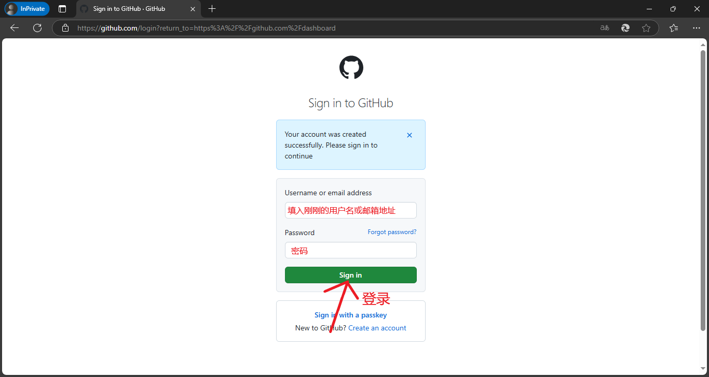
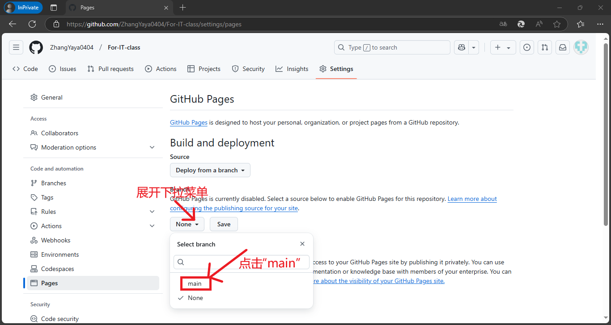

# GitHub页面教程

温馨提示：请先完整阅读一遍后在操作！！！

## 1、注册账号

### 1、进入网站

在预览器中输入“[github.com](https://github.com)”，进入后点击右上角”Sign up“开始注册。

### 2、填写信息

在”Email“中填写邮箱，”Password“中填入密码，”Username“中填入用户名。当三个输入框右边的叉全部变成勾时即可点击”Continue“。然后需要等待一段时间，界面如图。

### 3、进行人机验证

随便选一个进行人机验证（孩子，这并不难！）。

### 4、验证邮箱

人机验证过后会让你收一个验证码，查看你的邮箱收件箱中GitHub发来的那一条，并将中间的8位数验证码输进去，然后点击”Contine“。

## 2、登录

验证完成后会跳到登录页面，按照上图的提示输入信息，然后点击”Sign in“登录。

## 3、创建存储库

登陆后会跳转到这个页面，往下拉，找到”Start a new repository for xxx“，在”Repository name“中填入存储库名，在下面选择”Public“（必须是，不然之后无法创建页面。），然后点击”Create a new repository“创建。

## 4、上传文件

### 1、点击”uploading an existing file“。

### 2、重命名你的HTML文件

将HTML文件改名为”index.html“（必须是这个，不然创建页面后他无法识别。）。

### 3、将文件拖拽到页面中或点击”choose your files“

#### （对于4.3选择第二种方法的人）

在弹出的窗口中找到刚才的文件，选中它，点击”打开“。

### 4、点击”Commit changes“

### 5、等到上传即可

## 5、创建页面

### 1、文件上传完场后会跳转到这个界面，点击”Settings“。

### 2、点击”Pages“

### 3、选择分支

点击”branch“中的”None“所在的下拉菜单，选择”main“（一般是这个）。

### 4、保存

第二个下拉菜单（写着”/(root)“的）不用管，点击”Save“保存。

### 5、完成！

复制框出来的蓝色文本，在预览器中粘贴打开即可（刚刚创建的页面可能需要等一会才能进去。）。

## 6、附

### 1、重新打开后如何重新进入？

1、进入”[github.com](https://github.com)“,点击左边的存储库中你要用的那个。

2、如果需要添加文件，点击”Add file“的下拉菜单，并点击”Upload files“，就会跳到4.3中的界面。

# End.

©anghenuan